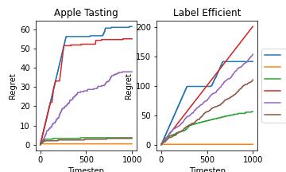
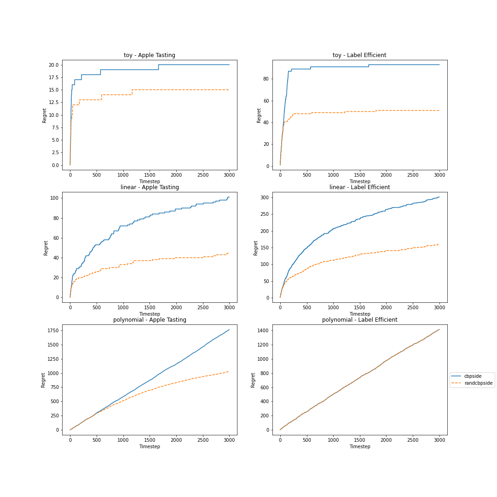

# Partial Monitoring tutorial

This repository contains implementations of multiple stochastic partial monitoring agents.

Requirements:
```
pip install numpy
pip install scipy
pip install matplotlib
pip install gurobipy
pip install numpy cython setuptools
```
The PM-DMED agent requires Guribipy and cyipopt, CBP-based agents require Gurobipy.

**First step:** identify the partial monitoring game you need. We have implemented the Apple Tasting and the Label Efficient games as well as all the quantities required by the proposed agents. 

```python
import numpy as np
import matplotlib.pyplot as plt

import games
game = games.apple_tasting(False)
game = games.label_efficient()
```

**Second step:** define an evaluation instance, called ```job```, where ```[p, 1-p]``` is a 2-dimensional outcome distribution ( Apple Tasting and Label Efficient games are 2-outcomes games):
```python
seed = 3
p = 0.8
job = [p, 1-p], seed 
```

**Third step:** evaluate a partial monitoring agent on the game instance:

```python
import evaluation
import TSPM
import PM_DMED
import cbp
import randcbp
import bpm

horizon = 100
evaluation.Evaluation(horizon)


###### PM-DMED:
c =1 
alg = PM_DMED.PM_DMED( game, horizon, c) 
result_pmdmed = ev.eval_policy_once(alg, game, job)

###### CBP:
alpha = 1.01
alg = cbp.CBP(  game, horizon, alpha )
result_cbp = ev.eval_policy_once(alg, game, job)

###### RandCBP:
alpha = 1.01
sigma = 1
K = 20
epsilon = 10e-7
alg = randcbp.RandCBP(  game, horizon, alpha, sigma, K, epsilon) 
result_randcbp = ev.eval_policy_once(alg, game, job)

###### BPMleast:
alg = bpm.BPM(  game, horizon )
result_bpmleast = ev.eval_policy_once(alg, game, job)

##### BPM-TS:
R = 0
alg = TSPM.TSPM_alg(  game, horizon, R) 
result_bpmts = ev.eval_policy_once(alg, game, job)

###### TSPM:
R = 1
alg = TSPM.TSPM_alg(  game,horizon, R) 
result_tspm = ev.eval_policy_once(alg, game, job)
```

**Fourth step:** plot the cumulative regret

```python
import matplotlib.pyplot as plt
plt.plot(range(horizon), result_pmdmed, label = 'pm-dmed' )
plt.plot(range(horizon), result_cbp, label = 'cbp' )
plt.plot(range(horizon), result_randcbp, label = 'randcbp' )
plt.plot(range(horizon), result_bpmleast, label = 'bpm-least' )
plt.plot(range(horizon), result_bpmts, label = 'bpm-ts' )
plt.plot(range(horizon), result_tspm, label = 'tspm' )
```



Note: this figure represents the performance of the agents on one realization of randomness and one outcome distribution.
To represent the average regret, you can use the method ```evaluate_parallel()``` used in some scripts.

**Contextual partial monitoring:** The contextual agents receive at each timestep a vector of observation before playing an action. The script ```synthetic_data.py``` includes simulators of features. The class ```ToyContexts``` can be used to debug, ```LinearContexts``` represents 2-dimensional contexts split over a linear decision boundary and ```QuinticContexts``` are split over a non-linear decision boundary. 

```python

import evaluation_contextual
import synthetic_data
import cbpside
import randcbpside
import PGIDSratio

fig, axes = plt.subplots(nrows=3, ncols=2, figsize=(15, 15))

horizon = 3000
seed = 2
p = 0.4

context_generator_toy = synthetic_data.ToyContexts( )
d = 2
margin = 0.01
context_generator_linear = synthetic_data.LinearContexts( np.array([0.5,0.5]), 0, d, margin)
context_generator_poly = synthetic_data.PolynomialContexts( d, margin)


for line, context_generator in enumerate( [  context_generator_toy, context_generator_linear, context_generator_poly ]): #context_generator_toy, context_generator_linear,

    for ax, game in enumerate([  games.apple_tasting(False), games.label_efficient() ]) :

        ev = evaluation_contextual.Evaluation_contextual(horizon)
        lbd = 0.05 #regularization

        job = [p, 1-p], context_generator, seed

        # ###### PG-IDS:
        # alg = PGIDSratio.PGIDSratio( game, horizon, context_generator.d_context )
        # result_pgids = ev.eval_policy_once(alg, game, job)

        ###### CBPside:
        alpha = 1.01
        alg = cbpside.CBPside(game, context_generator.d_context, horizon, alpha, lbd)
        result_cbpside = ev.eval_policy_once(alg, game, job)
        print(result_cbpside)

        ##### RandCBPside:
        alpha = 1.01
        sigma = 1
        K = 10
        epsilon = 10e-7
        alg = randcbpside.RandCPBside(  game, context_generator.d_context, horizon, alpha, lbd, sigma, K , epsilon)
        result_randcbpside = ev.eval_policy_once(alg, game, job)
        print(result_randcbpside)


        # axes[line][ax].plot(range(horizon), result_pgids, linestyle='dashed', label = 'pgids' )
        axes[line][ax].plot(range(horizon), result_cbpside, label = 'cbpside' )
        axes[line][ax].plot(range(horizon), result_randcbpside,linestyle='dashed', label = 'randcbpside' )

        axes[line][ax].set_xlabel('Timestep')
        axes[line][ax].set_ylabel('Regret')

        axes[line][0].set_title('{} - Apple Tasting'.format(context_generator.type) )
        axes[line][1].set_title('{} - Label Efficient'.format(context_generator.type) )

plt.legend(loc='center left', bbox_to_anchor=(1, 0.5))
plt.savefig('tutorial.png')

```


Note: The agent PG-IDS